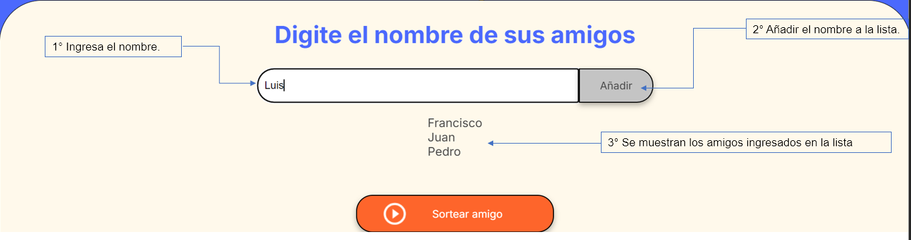

# Juego del Amigo Secreto

Es un juego en el que tendrás que ingresar varios nombres a trevés de un campo de texto. Despues de ingresar todos los nombres, podrás hacer un sorteo aleatorio donde solo uno de los nombres ingresados será escogido.

  
<b>Vista previa de la pantalla del juego<b/>

  

## 🔨 Funcionalidades del proyecto ✔️

- `Funcionalidad 1`: Agregar a la lista a sortear el nombre que el usuario va ingresar y mostrar en la lista el nombre ingresado.

    

- `Funcionalidad 2`: Cuando el usuario intente agregar con el campo de texto en blanco se mostrara un mensaje en el placeholder indicando que el campo de texto está vacío.

    

- `Funcionalidad 3`: Al momento de que el usuario intente ingresar un nombre repetido a la lista montrara una alerta inicando que nombre que está ingresando ya existe.

    

- `Funcionalidad 4`: Al presionar el botón de sortar amigo, se seleccionara un nombre de la lista de manera aleatoria.

    

## 📁 Acceso al proyecto

Para acceder al repositorio ingresa al siguiente enlace: 
    https://github.com/Zilini/amigo-secreto